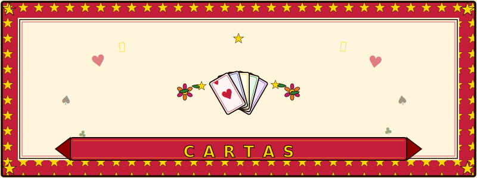

  

# cartas

A personal flashcard knowledge base.

## Cards

| Deck | Description |
|------|-------------|
| [Books](cards/Books/) | Book notes and summaries |
| [Cloud](cards/Cloud/cloud.md) | Cloud computing concepts |
| [German Language](cards/GermanLanguage/) | German vocabulary (B2, C1) |
| [Git Internals](cards/GitInternals/git_internals.md) | Git internals and mechanics |
| [IaC](cards/IaC/terraform.md) | Infrastructure as Code with Terraform |
| [Kubernetes Network Security](cards/KubernetesNetworkSecurity/k8s_egress.md) | K8s network security and egress |
| [Linux Fundamentals](cards/LinuxFundamentals/linux.md) | Linux fundamentals |
| [Networking Fundamentals](cards/NetworkingFundamentals/networking.md) | Networking fundamentals |
| [Observability](cards/Observability/observability.md) | Observability and monitoring |
| [Supply Chain Security](cards/SupplyChainSecurity/supply_chain_security.md) | Software supply chain security |
| [System Design](cards/SystemDesign/) | System design topics (foundations, caching, distributed systems, etc.) |
| [TrainingPeaks](cards/TrainingPeaks/metrics.md) | TrainingPeaks metrics and training concepts |
| [Virtualization](cards/Virtualization/virtualization.md) | Virtualization concepts |
