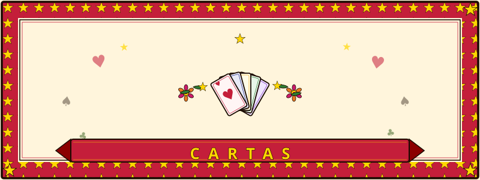

<p align="center">
  
</p>


# cartas

A personal flashcard knowledge base.

## Usage

[hashcards](https://github.com/SimonPersson/hashcards) is a plain-text spaced repetition system. Cards are stored as `Q:`/`A:` pairs in `.md` files; progress is tracked in `hashcards.db` files alongside them.

**Drill all decks** (from the repo root):
```sh
hashcards drill cards/
```

**Drill a single deck:**
```sh
hashcards drill cards/VibeCoding/
```

**Drill cards from a specific deck within a collection:**
```sh
hashcards drill cards/ --from-deck VibeCoding
```

**Limit new cards per session:**
```sh
hashcards drill cards/ --new-card-limit 20
```

**Check collection integrity:**
```sh
hashcards check cards/
```

**View statistics:**
```sh
hashcards stats cards/
```

The drill interface runs at `http://127.0.0.1:8000` and opens automatically in the browser. Cards are rated Forgot / Hard / Good / Easy and scheduled using spaced repetition.

## Cards

| Deck | Description |
|------|-------------|
| [AI Models](cards/AIModels/ai_models.md) | AI model landscape: Anthropic, Gemini, OpenAI, Meta, Mistral — capabilities, architecture, and key concepts |
| [Books](cards/Books/) | Book notes and summaries |
| [Cloud](cards/Cloud/cloud.md) | Cloud computing concepts |
| [German Language](cards/GermanLanguage/) | German vocabulary (B2, C1) |
| [Git Internals](cards/GitInternals/git_internals.md) | Git internals and mechanics |
| [Gut Training](cards/GutTraining/gut_training.md) | Gut adaptation for endurance sports: transporters, absorption limits, fueling protocols |
| [Go Libraries](cards/GoLibraries/go_libraries.md) | Go library design idioms and best practices |
| [IaC](cards/IaC/terraform.md) | Infrastructure as Code with Terraform |
| [Kubernetes Network Security](cards/KubernetesNetworkSecurity/k8s_egress.md) | K8s network security and egress |
| [Linux Fundamentals](cards/LinuxFundamentals/linux.md) | Linux fundamentals |
| [Networking Fundamentals](cards/NetworkingFundamentals/networking.md) | Networking fundamentals |
| [Observability](cards/Observability/observability.md) | Observability and monitoring |
| [Supply Chain Security](cards/SupplyChainSecurity/supply_chain_security.md) | Software supply chain security |
| [System Design](cards/SystemDesign/) | System design topics (foundations, caching, distributed systems, etc.) |
| [TrainingPeaks](cards/TrainingPeaks/metrics.md) | TrainingPeaks metrics and training concepts |
| [Vibe Coding](cards/VibeCoding/) | Best practices for AI-assisted development: prompting, workflow, review, testing, security, and pitfalls |
| [Virtualization](cards/Virtualization/virtualization.md) | Virtualization concepts |
